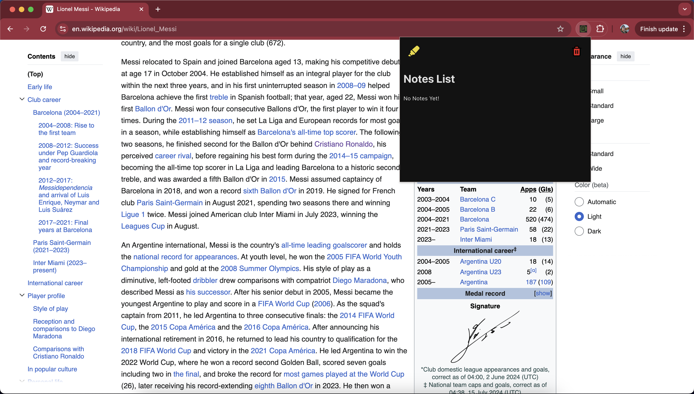

# notetaking-extension

This is a simple Google Chrome Extension that allows users to highlight
text on a Wikipedia webpage and then displays those highlights as notes in the UI.

As of now, the Chrome extension is temporary and some future plans include
adding some permanence.

Here are some images of how the extension works since it has not been published:

## How to test Chrome Extension:

1. Download or clone the repository.
2. Go to chrome://extensions/ in your browser.
3. Make sure that Developer Mode in the top right is toggled ON.
4. Click "Load Unpacked" in the top left corner.
5. Navigate to the repo you downloaded and choose the dist/ folder.

Extension should load after this step. You can test on any Wikipedia page.

## Steps to Use:

1. Go to Wikipedia page (perhaps your favorite sports player)
2. Highlight some text and open the extension. Click Highlighter after.
3. You can delete all highlights by clicking the trash icon.

## Future Plans:

Add permanence and add the functionality to other websites. Also planning to add
annotation capabilities.
